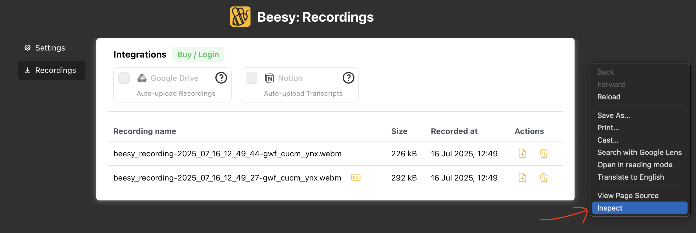
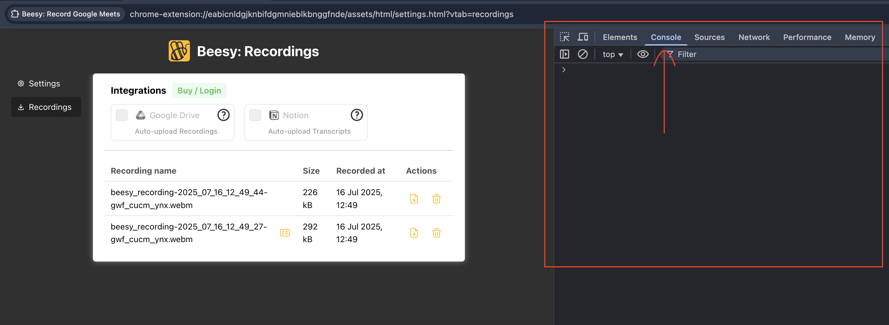
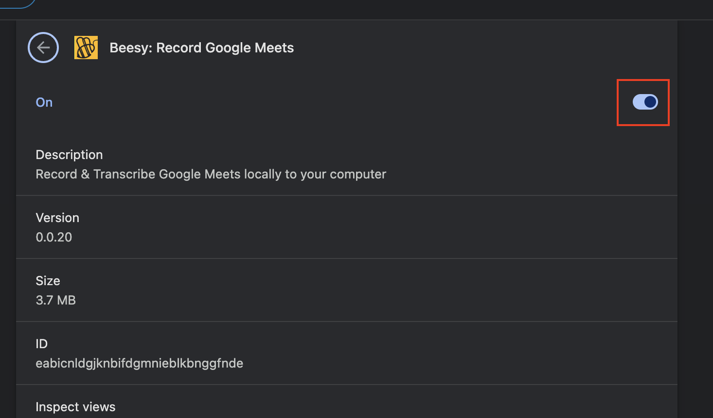

# Beesy: Troubleshooting Guide

If you are facing some issue with the extension, you may rectify the same this guide:

### Recording download failed

Large recordings may fail to download due to limited browser resources, follow these steps:

1. Right-click anywhere and click **Inspect**
   
2. Click on **Console** tab
   
3. Replace **YOUR_FILENAME_HERE** with the recording name that you are looking for like (_beesy_recording-2025_07_16_12_49_44-gwf_cucm_ynx.webm_) in the command below

   ```
    (async function downloadFile(fileName) {
      const opfsHandle = await navigator.storage.getDirectory();
      const recDir = await opfsHandle.getDirectoryHandle('beesy_recordings');
      const fileToDownloadHandle = await recDir.getFileHandle(fileName);
      const fileToDownload = await fileToDownloadHandle.getFile();
      const blb = new Blob([fileToDownload], {
        type: 'video/webm',
      });
      chrome.downloads.download({
        url: URL.createObjectURL(blb),
        filename: fileName,
      });

      const ccDir = await opfsHandle.getDirectoryHandle('beesy_cc');
      try {
        const ccFileHandle = await ccDir.getFileHandle(fileName + '.txt');
        const ccFile = await ccFileHandle.getFile();
        const ccBlob = new Blob([ccFile], {
          type: 'text/plain',
        });
        chrome.downloads.download({
          url: URL.createObjectURL(ccBlob),
          filename: ccFile.name,
        });
      } catch (error) {
        if (error.name === 'NotFoundError') {
          console.log('No CC file found for', fileName);
          return
        }
        // Handle other errors if necessary
        // For example, you might want to log the error or show a message to the user
        console.error('Error retrieving CC file:', error);
      }
    })('YOUR_FILENAME_HERE')
   ```

4. Paste the modified command in **Console** and press _Enter_ to download the file

### Recording didn't start within 5 seconds

Recording may be delayed or fail to start within 5 seconds. Follow the steps below to fix it.

1. Go [to Beesy extension details](chrome://extensions/?id=eabicnldgjknbifdgmnieblkbnggfnde) page
2. Re-enable extension once
   
3. Refresh active Google Meet page once again to re-active Beesy.
4. You likely won't see the error again.
