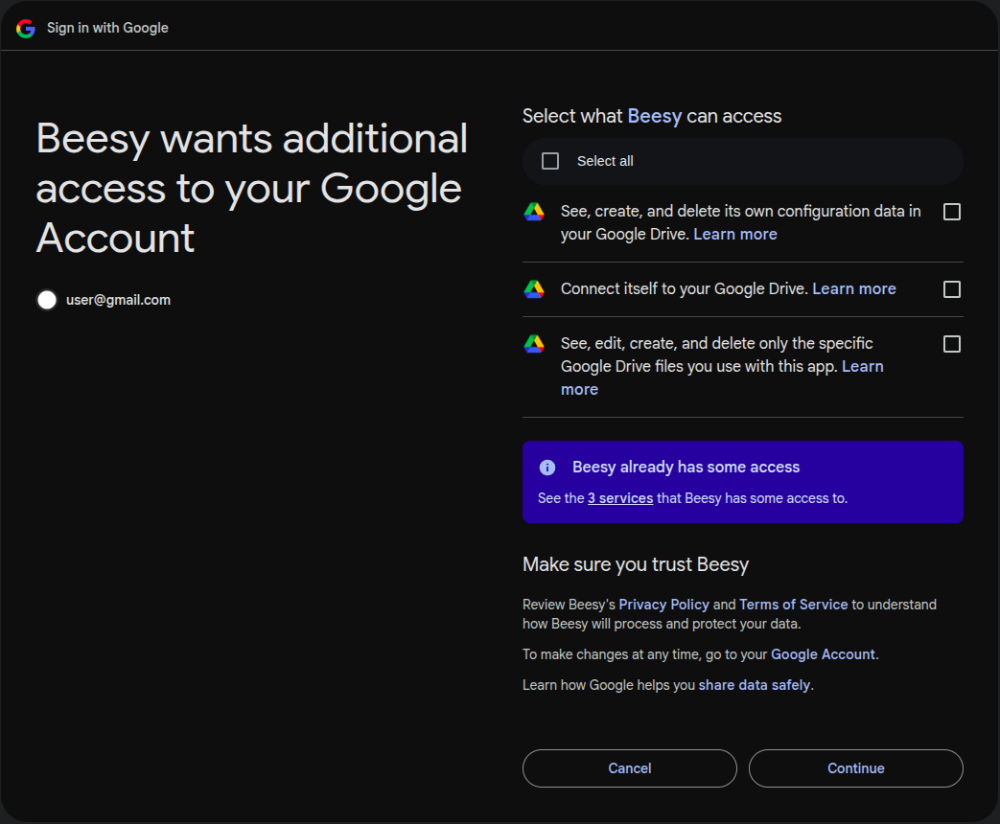

# Google Drive: Upload Recordings

Your recordings are seamlessly uploaded to Google Drive. Here's what you need to know:

---

### 📌 Key Points

1. **Account Sync**
   Uploads will go to the **same Google Drive account** used during **premium purchase**.

2. **Permission Required**
   Clicking the extension icon triggers Google Drive integration.

   > 👉 Ensure you **allow required permissions** to upload and manage files.

   

3. **Storage Location**
   All recordings will be stored under a folder named `Beesy Recordings`
   Files follow the **same naming syntax** as shown on the extension’s recording page.

4. **Auto Resume**
   Uploads that get interrupted will **automatically resume** once you're back online or the issue is resolved.

5. **Deletion Behaviour**
   Deleting a recording from the extension's recording page **does NOT delete** it from your Google Drive.

6. **Direct Download from Drive**
   Recordings downloaded directly from Google Drive may **lack timestamps** or have **broken seek functionality**.
   To fix this, head to the extension’s **`Magic`** tab and apply the repair.

---
