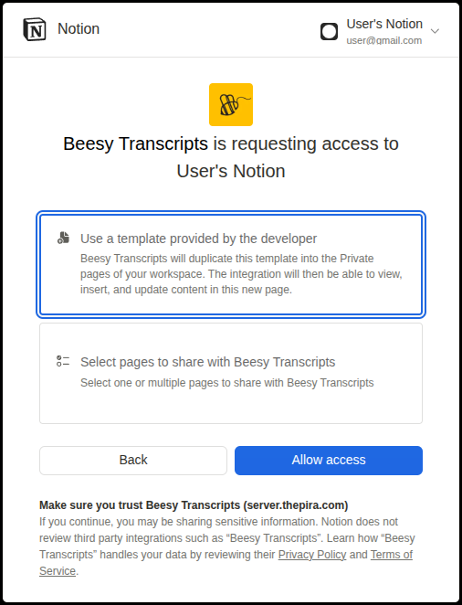
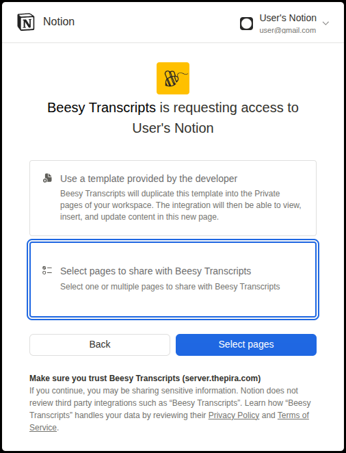
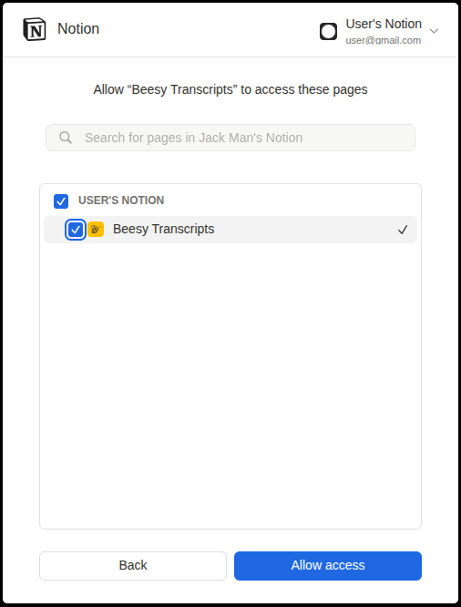

# Notion: Upload Transcripts

Your transcripts are automatically uploaded to Notion. Here's what you need to know:

---

### Steps to activate Notion integration
1. Clicking the Notion icon will start the authorization process.
2. 👉 First-time users

   Select the option **Use a template provided by the developer**.
   
      

3. 👉 Returning users

   Select the option **Select pages to share with Beesy Transcripts** and select **Beesy Transcripts** from that list.
   
   
   

---

### Key Points

1. **Storage Location**: 
   All transcripts will be saved under a parent Notion page titled **`Beesy Transcripts`**.
   
2. **Auto Resume**: 
   If the upload to Notion is interrupted, the extension will **automatically retry** until successful.

3. **Deletion Behavior**: 
   Deleting a transcript from the recording page **does NOT delete** it from Notion.

4. **Notion Beesy Transcripts Page**: 
   Use the transcripts as you wish, but please don't modify anything on this parent `Beesy Transcripts` page, it might break the uploads. More details [here](https://thepiraorg.notion.site/18838e779a4c806aac6eff79805433d8?v=18838e779a4c8105a1c2000cc1ecb900&p=18838e779a4c81c5bc36f90ff489fd79&pm=s)

---
